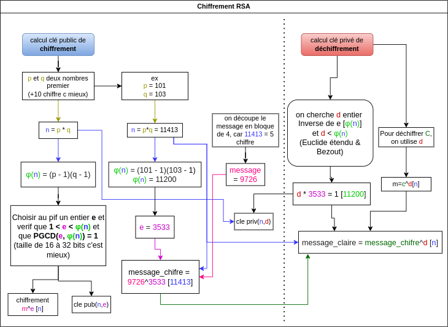

# chiffrement-rsa

Re développement de tout le protocole de chiffrement RSA asymétrique en partant de 0 en python, pas d'utilisation de librairie de cryptographie externe

lancer le programme : python rsa.py

## Dockerfile disponible

docker build -t rsa_py .

docker run -it rsa_py

-------------------

Fonctionne avec Python 3.10.6




CHIFFREMENT

Conversion en int du message
Découpage en blocs du message int et ajou de 1
Chiffrement de chaque block int plus 1
Conversion en Hex des block chiffré
Addition des block hex séparé par des -

DECHIFFREMENT
string block hex séparé par des - converti en tableau dex
Tableau de blocs hex en tableau de int
Dechiffrement des block int
Découpage des int en enlevant les "1" devant les chiffres, renvois un tableau de String
Conversion tableau de string en grand String
Conversion String int
Conversion int message

**Question 1 :** Écrire un programme d’exponentiation rapide.

Dans le code, le programme d'exponentiation rapide est implémenté dans la fonction **`exponentiation_rapide(base, exposant, modulo)`**. Cette fonction prend en entrée une base, un exposant et un modulo, et renvoie le résultat de **`(base^exposant) mod modulo`** de manière optimisée.

Voici le code de cette fonction :

```
pythonCopy code
def exponentiation_rapide(base, exposant, modulo):
    if modulo == 1:
        return 0
    resultat = 1
    base = base % modulo
    while exposant > 0:
        if exposant % 2 == 1:
            resultat = (resultat * base) % modulo
        exposant = exposant // 2
        base = (base * base) % modulo
    return resultat

```

**Question 2 :** Écrire un programme du calcul des coefficients de Bézout.

Le calcul des coefficients de Bézout est implémenté dans notre code via la fonction **`coefficients_bezout(a, b)`**. Cette fonction utilise l'algorithme d'Euclide étendu pour trouver les coefficients de Bézout de deux entiers a et b.

Voici le code de cette fonction :

```
pythonCopy code
def coefficients_bezout(a, b):
    x0, x1, y0, y1 = 1, 0, 0, 1
    while b:
        q, a, b = a // b, b, a % b
        x0, x1 = x1, x0 - q * x1
        y0, y1 = y1, y0 - q * y1
    return x0, y0

```

**Question 3 :** Écrire un programme de chiffrement RSA.

Le chiffrement RSA est réalisé dans notre code par la fonction **`chiffrement_RSA(m, e, n)`**. Cette fonction prend en entrée un message sous forme d'entier (m), une clé publique (e), et le produit de deux nombres premiers (n), et renvoie le message chiffré.

Voici le code de cette fonction :

```
pythonCopy code
def chiffrement_RSA(m, e, n):
    return exponentiation_rapide(m, e, n)

```

De plus, dans notre programme, nous avons également une fonction **`chiffrement_RSA_text(cle_pub, text)`** qui chiffre un texte entier en utilisant le RSA. Cette fonction convertit le texte en entier, le découpe en blocs, chiffre chaque bloc, et renvoie la chaîne de tous les blocs chiffrés.

Voici une liste des fonctionnalités majeures ajoutées (non demandée dans l’énoncée) à notre programme en plus des fonctions de base du chiffrement RSA:

1. **Déchiffrement :** En plus du chiffrement, notre programme propose une fonctionnalité de déchiffrement. Après que le message a été chiffré avec la clé publique, cette fonctionnalité permet d'utiliser la clé privée pour déchiffrer le message et le ramener à son état original.
2. **Découpage en blocs du message** : Pour rendre le chiffrement RSA utilisable avec des messages de taille variée, notre programme découpe le message en plusieurs blocs. Cela permet de traiter chaque bloc de manière individuelle lors du chiffrement et du déchiffrement. (Un nombre ne peut pas être chiffré s'il est plus grand que n)
3. **Ajout d'un "1" avant chaque bloc** : Pour résoudre le problème des blocs commençant par zéro, notre programme ajoute un "1" devant chaque bloc. Cette modification garantit qu'aucune information n'est perdue lors du traitement des blocs.
4. **Gestion des erreurs et exceptions** : Notre programme contient des mécanismes de gestion des erreurs pour traiter les exceptions et les cas où les données d'entrée ne sont pas valides. Cela améliore la robustesse du programme.
5. **Interface utilisateur dans le terminal** : Pour faciliter l'utilisation du programme, nous avons créé une interface utilisateur dans le terminal. Cela permet à l'utilisateur de générer des clés, de chiffrer et déchiffrer des messages.
6. **Tests de vérification du chiffrement et déchiffrement** : Notre programme inclut des tests pour vérifier le bon fonctionnement du chiffrement et du déchiffrement RSA. Ces tests sont cruciaux pour s'assurer que le programme fonctionne comme prévu. (fichier test_rsa?py)
7. **Génération de clé aléatoire robuste** : Notre programme prend en compte les recommandations de taille de clé pour assurer un chiffrement robuste. Il génère des paires de clés publiques et privées de manière aléatoire en utilisant des nombres premiers de taille suffisante, rendant ainsi le chiffrement résistant aux attaques par force brute.

**Scénario d’exécution :**

**Génération d'une nouvelle clé RSA** :

1. **mode = input()** : L'utilisateur entre "3" pour générer une nouvelle clé.
2. **recherche_prochain_nombre_premier(random.randint(10000000000, 1000000000000))** : génère un nombre premier aléatoire p.
3. **recherche_prochain_nombre_premier(random.randint(10000000000, 1000000000000))** : génère un nombre premier aléatoire q.
4. **recherche_prochain_nombre_premier_avec_phi_n(random.randint(10000000, 1000000000), phi_n)** : génère un nombre premier aléatoire e qui est coprime avec phi_n (produit de (p-1) et (q-1)).
5. **coefficients_bezout(e, phi_n)** : trouve le coefficient de Bézout pour e et phi_n. La première valeur retournée est d, l'exposant de déchiffrement dans le chiffrement RSA.
6. **print("cle publique (n leng " + str(len(str(abs(n)))) + "): " + n_hex + "-" + e_hex)** : Affiche la clé publique à l'utilisateur.
7. **print("cle privee: " + n_hex + "-" + d_hex)** : Affiche la clé privée à l'utilisateur.

**Chiffrement d'un texte avec RSA** :

1. **mode = input()** : L'utilisateur entre "1" pour chiffrer un message.
2. **key_user_input_hex = input()** : L'utilisateur entre la clé publique.
3. **text_user_input_clear = input()** : L'utilisateur entre le message en clair à chiffrer.
4. **key_clear(key_user_input_hex)** : divise la clé publique en deux composants entiers : n et e.
5. **text_to_int2(text_user_input_clear)** : convertit le texte en clair en une valeur entière.
6. **decoupage_int_en_blocs_plus1(test_m_int, leng_n - 2)** : découpe l'entier du message en blocs de taille appropriée.
7. **chiffrement_RSA(bloc, test_e, test_n)** : chiffre chaque bloc du message en utilisant la clé publique RSA.
8. **hex(chiffrement_RSA(bloc, test_e, test_n))[2:]** : convertit chaque bloc chiffré en une représentation hexadécimale.
9. **print(chiffrement_RSA_text(key_user_input_hex, text_user_input_clear))** : Affiche le message chiffré à l'utilisateur.

**Déchiffrement d'un texte avec RSA** :

1. **mode = input()** : L'utilisateur entre "2" pour déchiffrer un message.
2. **key_user_input_hex = input()** : L'utilisateur entre la clé privée.
3. **text_user_input_hex = input()** : L'utilisateur entre le message chiffré à déchiffrer.
4. **key_clear(key_user_input_hex)** : divise la clé privée en deux composants entiers : n et d.
5. **stringHex_to_tabHex(text_user_input_hex)** : convertit la chaîne hexadécimale chiffrée en un tableau de blocs hexadécimaux.
6. **tabHex_to_tabInt(m_hex_tab)** : convertit le tableau de blocs hexadécimaux en un tableau d'entiers.
7. **dechiffrement_tableau(m_int_tab, d, n)** : déchiffre chaque bloc en utilisant la clé privée RSA.
8. **remove_first_char_if_one(m_dechiff_tabInt)** : retire le premier caractère de chaque bloc déchiffré s'il est "1".
9. **tabStr_to_str(m_dechiff_tabStr_moin1)** : convertit le tableau de blocs déchiffrés en une seule chaîne.
10. **int(m_result_str)** : convertit la chaîne obtenue en entier.
11. **int_to_text2(m_result_int)** : convertit l'entier en texte, récupérant le message original.
12. **print(dechiffrement_RSA_text(key_user_input_hex, text_user_input_hex))** : Affiche le message déchiffré à l'utilisateur.

**Les Difficultés :**

**1. Gestion des blocs de données** :
La manipulation de grandes quantités de données sous forme de blocs s'est avérée délicate, notamment lors de la division d'entiers en blocs. Le principal problème survenu lors du découpage d'entiers en blocs était la production de blocs commençant par un zéro. Ceci n'est pas possible pour un entier, car le zéro initial est supprimé, ce qui peut entraîner une perte d'information importante.

Solution proposée : Un "1" a été ajouté de manière artificielle au début de chaque nombre pour résoudre ce problème.

**2. Conversion de données en texte** :
Le processus de conversion de données en texte a également présenté des défis, principalement en raison des différentes méthodes d'encodage disponibles et de leur gestion. Les problèmes d'encodage peuvent entraîner des erreurs de conversion et des pertes d'information.

**3. Conception du programme** :
Alors que la création du programme de chiffrement était relativement simple, le déchiffrement s'est avéré plus compliqué, nécessitant une attention et une précision accrues.

**4. Génération de clés RSA** :
La génération de clés a fonctionné correctement, bien qu'il reste des marges d'optimisation pour rendre le processus plus efficace et plus rapide.

**5. Problèmes lors du déchiffrement** :
L'une des principales difficultés rencontrées a été lors de l'exécution de la fonction de test **`test_chiffrement_dechiffrement_block()`**. La valeur déchiffrée à la fin n'était pas identique à la valeur initiale avant le chiffrement. Cela a entraîné l'échec du test d'assertion. Le problème venait  de la fonction **`remove_first_char_if_one()`** qui supprime le premier caractère "1" des nombres, et retournait un tableau de int ce qui supprime donc automatiquement les “0” devant les parties découpée du grand int représentant le message. Ce qui a entraîné une perte d'information significative dans certains cas.

Dans l'ensemble, la création de ce programme de chiffrement RSA a fourni une opportunité d'apprentissage précieuse, malgré les défis rencontrés. Les solutions aux problèmes rencontrés ont été trouvées par la suite et ont conduit à l'amélioration du programme.

